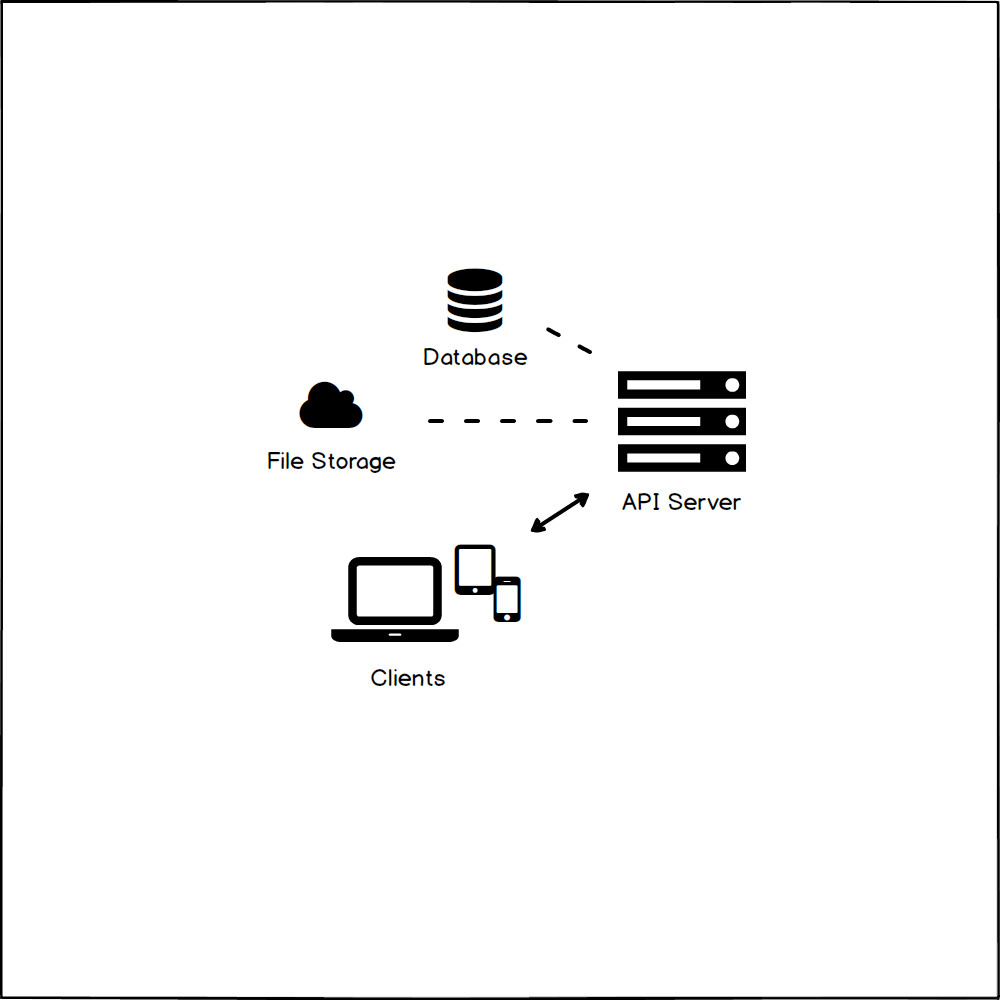

# Notes

Personal project to organize notes into groups.

<!-- TODO Replace with GIF-animated preview of the app after release. -->

See [Wiki](https://github.com/desmarais-patrick/notes/wiki/) for documentation.

## Sub-Projects

 - [API server](https://github.com/desmarais-patrick/notes-api-server-nodejs/)
 - [Web application client](https://github.com/desmarais-patrick/notes-web-client-js/)

## License

[MIT](https://choosealicense.com/licenses/mit/)
