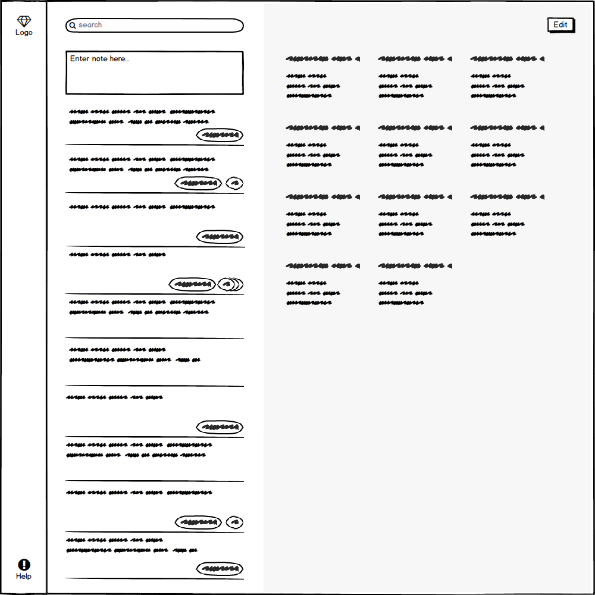
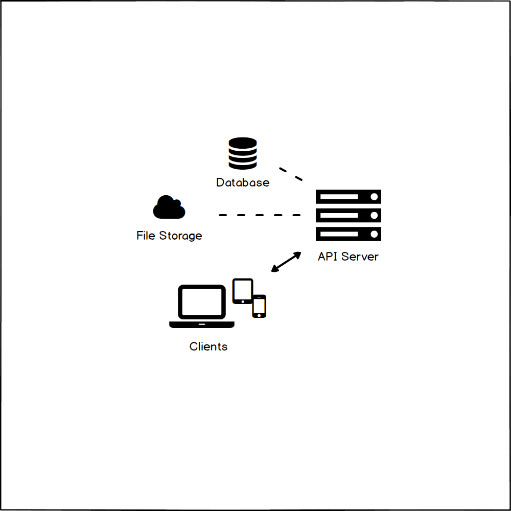

# Notes

Personal project to organize notes into groups.

<!-- TODO Replace with GIF-animated preview of the app after release. -->

See [Wiki](https://github.com/desmarais-patrick/notes/wiki) for documentation.

## Sub-Projects

 - [Web application client](https://github.com/desmarais-patrick/notes-web-client-js)
 - [API server](https://github.com/desmarais-patrick/notes-api-server-nodejs)
 - [Database server](https://github.com/desmarais-patrick/notes-db-server-mongodb)
 - [Gateway server](https://github.com/desmarais-patrick/notes-gateway-server-nginx)
 - [Static files](https://github.com/desmarais-patrick/notes-static-files)
 - [Auth server](https://github.com/desmarais-patrick/notes-auth-server)

## License

[MIT](https://choosealicense.com/licenses/mit/)
