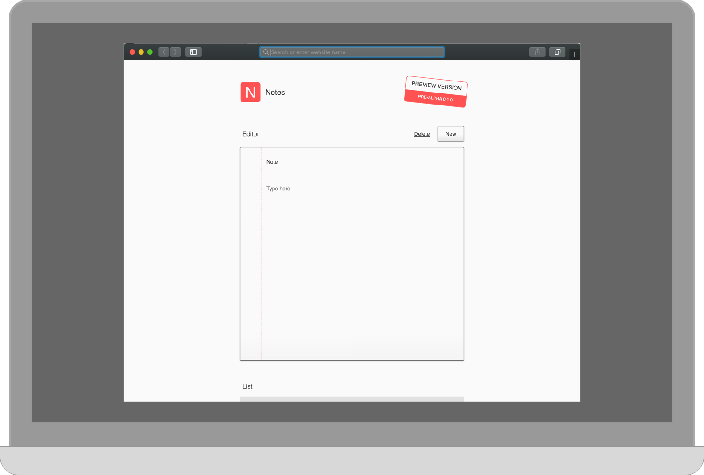
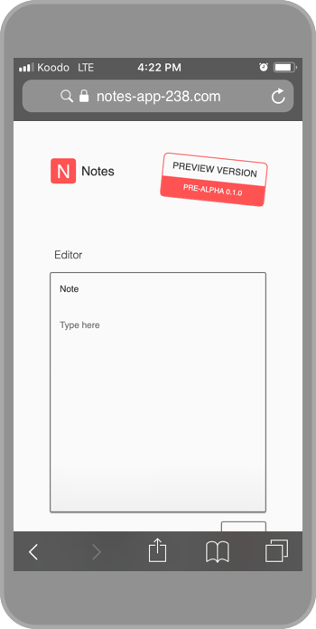

# Notes

Notes is a personal project aiming to build a Web application to take notes.

The application was first released in August 2019.

See the project website for more information about this project:
[www.notes-app-238.com](http://www.notes-app-238.com/).

Documentation is also available in the Wiki.

## Sub-Projects

 - [API server](https://github.com/desmarais-patrick/notes-api-server-nodejs/)
 - [Web application client](https://github.com/desmarais-patrick/notes-web-client-js/)

## License

[MIT](https://choosealicense.com/licenses/mit/)
